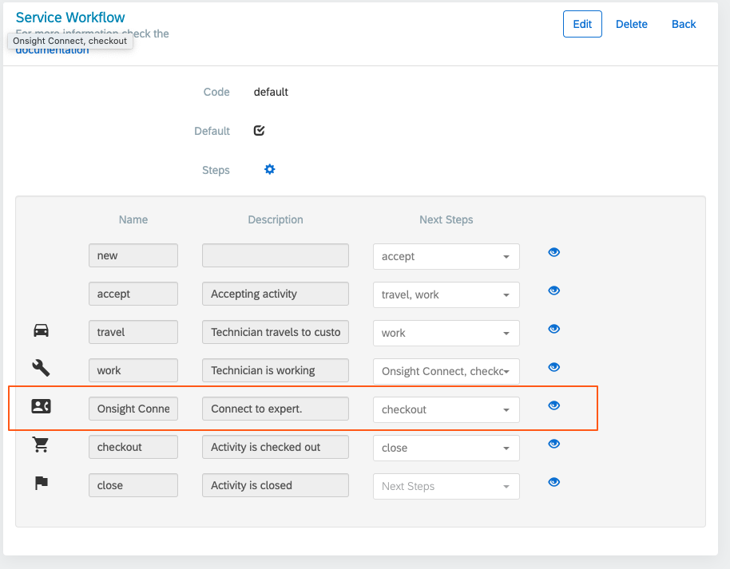

# FSM Extension for Onsight Connect

#### Notes
   * The term "customer" refers to the Onsight customer wishing to integrate their Onsight Connect account with their SAP FSM application.
   * The variable *\{fsmHost\}* refers to the datacenter where your FSM application is deployed.
     * e.g., "eu.coresystems.net" or "us.coresystems.net"

---

## Pre-requisites

   - The Onsight Connect extension operates on FSM Activities which are typically
      part of Service Calls.
    - There are two sets of persons who can be called via the Onsight Connect extension:
        - The Activity's Contact.
        - The Activity's assigned Responsibles. This is the person 
          or persons assigned to this Activity. Note that this is applicable to the FSM Web app only,
          as it is expected that the mobile app user is the person responsible for the selected Activity
          and therefore cannot call themselves.
        - To be reachable by Onsight, the Contact's and/or Responsibles' email addresses must be part of the customer's Onsight domain
          - Onsight external contacts are not currently supported, as there is no defined way of getting
          - that external contact's SIP address from FSM.
    - **(FSM Web):** The FSM account administrator must generate a Client ID/Client Secret pair for each FSM coresystems datacenter
      in which their FSM app is hosted. These credentials will be used by the Onsight extension to communicate
      with the FSM APIs.
        - For example, if the customer has FSM hosted at eu.coresystems.net and us.coresystems.net, the administrator
          would need to generate two Client ID/Client Secret pairs, one for each datacenter.
    - **(FSM Web) [Optional]**: If desired, a 3rd-party OpenID Connect provider can be used with the Onsight extension.
      If enabled, the logged-in FSM web user's identity will be verified via an OpenID Connect login consent screen
      (displayed within the Onsight extension's plugin frame). This verifies that the FSM web user can be mapped to a known
      Onsight user account. To enable OpenID Connect verification, the following information from your identity provider is needed:
        - The authorize URL (e.g., https://my-idp.com/api/oauth2/v1/authorize)
        - The token URL (e.g., https://my-idp.com/api/oauth2/v1/token)
        - The user info URL (e.g.,  https://my-idp.com/api/oauth2/v1/userinfo)
        - The Client ID
        - The Client Secret

---

## Installation

   - Installation can be performed either of two ways:
        1) From the SAP FSM extension catalog: https://{fsmHost}/shell/#/foundational-services/extension-management/directory, **OR**
        2) Manaully, by clicking the "Add Extension" button and choosing "Manual" installation: https://{fsmHost}/shell/#/foundational-services/extension-management/extensions
            - For the Extension Access URL, use: https://sap-connect-cogswellsprockets.azurewebsites.net

---

## Post-Install Configuration

   #### Mobile

   The FSM mobile app (available for download from the app stores) can be customized to integrate Onsight Connect.
   This is done by adding a new step to the field technician's Service Workflow process. At this time,
   configuration of the FSM mobile app for use with Onsight Connect is a manual process which must be
   performed by the FSM administrator.

   The following steps must be performed in order to activate the mobile extension:

   1) A new or existing Service Workflow must be modified to include a new Workflow Step:
    https://{fsmHost}/admin/accounts/{accountId}/companies/{companyId}/serviceWorkflows
   2) The new Workflow Step should be placed in an appropriate location within the Workflow and be connected to any succeeding steps. The image below illustrates an example of a new "Onsight Connect" Workflow Step inserted into a default Workflow, after the "work" step and before the "checkout" step:

         

   3) The new Workflow Step should be set to a Screen Type of "External application".
   4) The Workflow Step's Configuration should be set to the following:
         ```
        {
           "android": {"url": "https://sap-connect-cogswellsprockets.azurewebsites.net/FsmMobileIndex?from=${activity.responsibles[0].emailAddress}&to=${activity.contact.emailAddress}&toFirst=${activity.contact.firstName}&toLast=${activity.contact.lastName}&meta=eqp:${activity.equipment.code};act:${activity.code}"},
           "ios": {"url": "https://sap-connect-cogswellsprockets.azurewebsites.net/FsmMobileIndex?from=${activity.responsibles[0].emailAddress}&to=${activity.contact.emailAddress}&toFirst=${activity.contact.firstName}&toLast=${activity.contact.lastName}&meta=eqp:${activity.equipment.code};act:${activity.code}"}
        }
         ```

   #### Web

   At this time, in order to complete installation of the Onsight extension with the FSM web app, the
   customer must contact Librestream to have their FSM credentials added to the extension's database. Without
   this configuration, the FSM web app will not work with the FSM extension.

   Once the customer has been added to the Onsight extension database, the FSM administrator must enable
   the extension in the web UI. This is done through the standard FSM extension mechanism:
   
   - Click "Open Extension Configuration" from the "..." menu in the upper-right-hand corner of FSM,
     which will place the UI into "Configuration Mode".
   - On the right-hand-side, under the "PLUG-IN" section, click the "Add Extension" button.
   - From the list of extensions, click "onsight-connect" and then the "Add" button.
   - Finally, click the "Configuration Mode" text at the top to return to normal mode.
